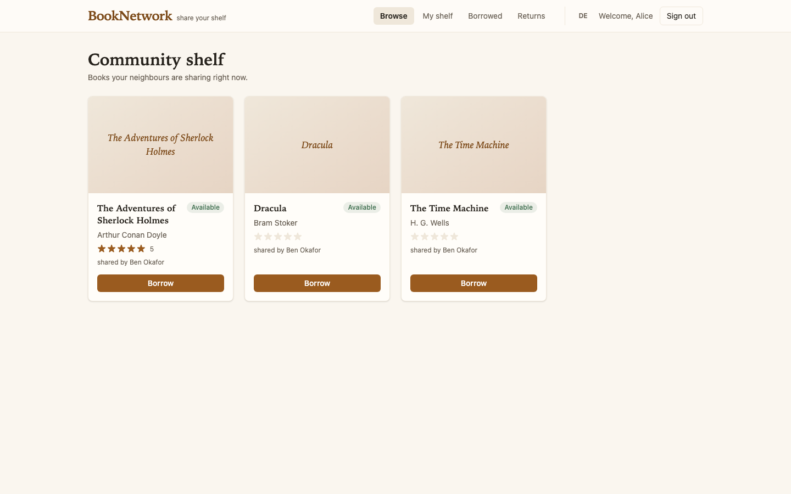
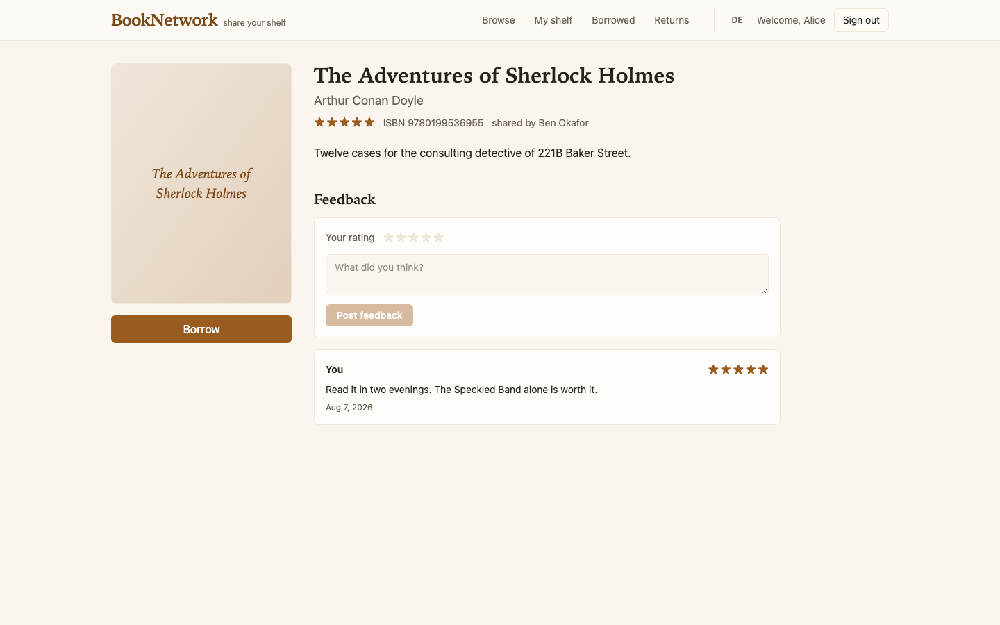
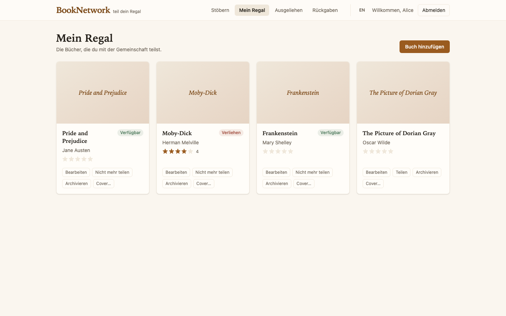
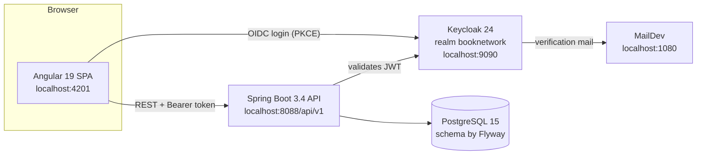

# BookNetwork

*Share your shelf.* BookNetwork is a community book-lending application:
members put their own books on a shared shelf, borrow from each other, hand
books back, and rate what they have read. Owners stay in control — a return
only frees a book once its owner approves it.


The interface speaks English and German and switches at runtime, without a
reload. Business rules surface as machine-readable codes that the UI
translates — the backend never ships display text.

| Community shelf | Book detail with feedback | Runtime language switch |
| --- | --- | --- |
|  |  |  |

## Architecture



The backend is a stateless OAuth2 resource server; identity lives entirely in
Keycloak, and the application mirrors only what it needs to attach books,
loans and feedback to a person. Catalog, lending and feedback are separate
modules that reference each other by id — list queries carry their
cross-module facts (average rating, availability) in a single statement, and
the invariant "one live loan per book" is enforced by a partial unique index
in the database rather than by application luck.

## Getting started

Prerequisites: Docker, JDK 17, Node 20+.

```bash
docker compose up -d                     # PostgreSQL, Keycloak (9090), MailDev (1080)
cd booknetwork && ./mvnw spring-boot:run # API on http://localhost:8088/api/v1
cd booknetwork-ui && npm ci && npm start # UI on http://localhost:4201
```

Keycloak imports the `booknetwork` realm on first start; Flyway creates the
schema and seeds a small demo shelf. Two demo accounts ship with the realm —
`alice@booknetwork.dev` and `ben@booknetwork.dev`, password `booknetwork`.
New members can register themselves: the verification mail arrives in MailDev
at `http://localhost:1080`. Every credential in this repository is a local
development value, not a secret.

## Domain rules

A book can be lent to one member at a time. Members cannot borrow or rate
their own books, only the borrower can return a loan, only the owner can
approve the return, and feedback is reserved for members who actually
borrowed the book. Violations answer with `409` and a stable code
(`already_borrowed`, `never_borrowed`, `not_owner`, …).

## API

The backend publishes its OpenAPI description at `/api/v1/v3/api-docs`
(Swagger UI at `/api/v1/swagger-ui.html`). The frozen copy
`booknetwork-ui/openapi.json` is the source the typed Angular client is
generated from — regenerate with `npx ng-openapi-gen` after API changes.

## Tests

```bash
cd booknetwork-e2e && npm ci && npx playwright install chromium && npm test
```

The Playwright suite drives the full lending arc through real Keycloak
logins — Alice borrows Ben's book, returns it, Ben approves — and leaves the
data exactly as it found it, so it can run repeatedly against the same stack.

## Repository layout

| Folder | Contents |
| --- | --- |
| `booknetwork/` | Spring Boot backend: catalog, lending and feedback modules, Flyway migrations, Keycloak resource-server security. |
| `booknetwork-ui/` | Angular web app: standalone components, Tailwind CSS, Transloco i18n, generated API client. |
| `booknetwork-e2e/` | Playwright end-to-end suite. |
| `keycloak/realm/` | Realm definition, imported automatically at container start. |
| `docs/` | Screenshots and documentation assets. |

## License

Apache License 2.0 — see [LICENSE](LICENSE).
